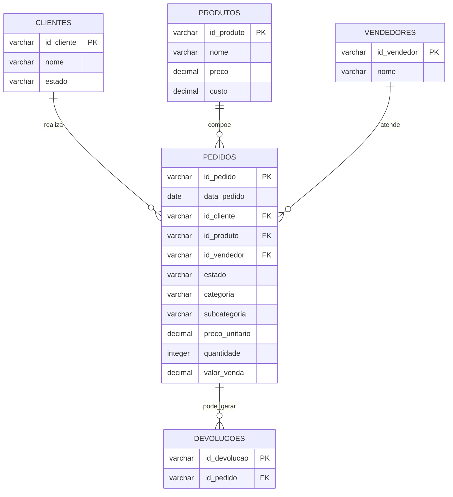

# Modelo de Dados

## Diagrama entidade-relacionamento

## Relacionamentos

| Origem | Cardinalidade | Destino | Interpretação |
| --- | --- | --- | --- |
| Clientes | 1:N | Pedidos | Um cliente pode realizar vários pedidos; cada pedido pertence a um cliente. |
| Produtos | 1:N | Pedidos | Um produto pode estar em diversos pedidos; cada pedido referencia um produto. |
| Vendedores | 1:N | Pedidos | Um vendedor pode atender diversos pedidos; a referência pode ser opcional. |
| Pedidos | 1:N | Devoluções | Um pedido pode não ter devolução ou registrar uma ou mais ocorrências conforme a regra da fonte. |

## Regras de modelagem

- `id_pedido`, `id_cliente`, `id_produto`, `id_vendedor` e `id_devolucao` são chaves primárias das respectivas entidades.
- As chaves em `pedidos` e `devolucoes` preservam a integridade referencial entre os eventos de venda e as dimensões de análise.
- O custo fica em `produtos`; por isso, o lucro é calculado a partir do valor vendido no pedido e do custo multiplicado pela quantidade.
- Categoria e subcategoria permanecem no registro do pedido para permitir análise do histórico mesmo que o cadastro de produtos seja atualizado.
